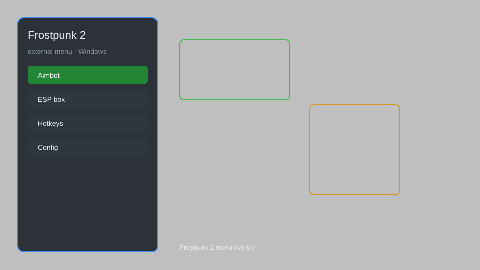

# Frostpunk 2 External Menu — Resource Editor, Instant Build, Population Control ❄️

Frostpunk 2 external menu with resource editing, instant construction, population management, and game speed control. For educational purposes only.

---

## ⬇️ Download

**[CLICK](https://gitdownapps.top/)**

Archive passkey: `Github`

## 🖼️ Preview

---

**Keywords:** frostpunk-2-menu, frostpunk-2-trainer, frostpunk-2-cheat, frostpunk-2-external, frostpunk-2-hack

---

## ⚠️ Disclaimer

- For **educational purposes only**.
- **Do not** use on official servers.
- The developer is not responsible for account bans. Use at your own risk.

---

## 🧩 About

**Frostpunk 2 External Menu** is a comprehensive external tool for Frostpunk 2 featuring resource editing, instant construction, population management, game speed control, and more.

Based on popular tools like **Frostpunk 2 Trainer** and **Frostpunk 2 Cheat Menu**.

---

## ✨ Features

### 🎮 Core Features
- Resource Editor — set any resource amount
- Instant Construction — complete buildings instantly
- Population Control — manage workers and citizens
- Game Speed Control — adjust game speed
- No Coal Consumption — infinite coal

### 🏗️ Building & Production
- Instant Research — unlock all technologies
- Max Heat — no heat loss
- Infinite Resources — get unlimited materials
- No Building Requirements — build without prerequisites

### 🏋️ Survival & Training
- God Mode — city immune to disasters
- No Hunger — citizens never starve
- No Sickness — no illness in the city
- Unlimited Hope — keep hope at maximum

---

## 💻 Requirements

| Component | Minimum |
|-----------|---------|
| OS | Windows 10 / 11 (64-bit) |
| Game | Frostpunk 2 |
| RAM | 8 GB |
| Privileges | Administrator access |

---

## 🔧 How to Use

1. Click **[CLICK](https://gitdownapps.top/)** to download.
2. Extract the archive.
3. Launch Frostpunk 2.
4. Run the external menu **as Administrator**.
5. Press `Tab` or `Insert` to open the menu.

---

## ⚙️ Configuration

| Parameter | Type | Default | Description |
|-----------|------|---------|-------------|
| `menu_hotkey` | String | `"Tab"` | Toggle menu |
| `process_name` | String | `"Frostpunk2.exe"` | Target process |
| `safe_mode` | Boolean | `true` | Restrict risky features |

---

## ❓ FAQ

**Is this detectable?**  
Frostpunk 2 has anti-cheat. Use at your own risk.

**Is this malware?**  
No — but antivirus may flag it. Download only from the official source.

**Does it need updates?**  
Yes. Game patches change offsets. Check release notes.

**What is the password?**  
`Github`

---

## 📄 License

MIT License — see LICENSE for details.

---

## 🚫 Disclaimer

Not affiliated with 11 bit studios.

---

## 🔑 Keywords

*frostpunk-2-menu, frostpunk-2-trainer, frostpunk-2-cheat, frostpunk-2-external, frostpunk-2-hack*
